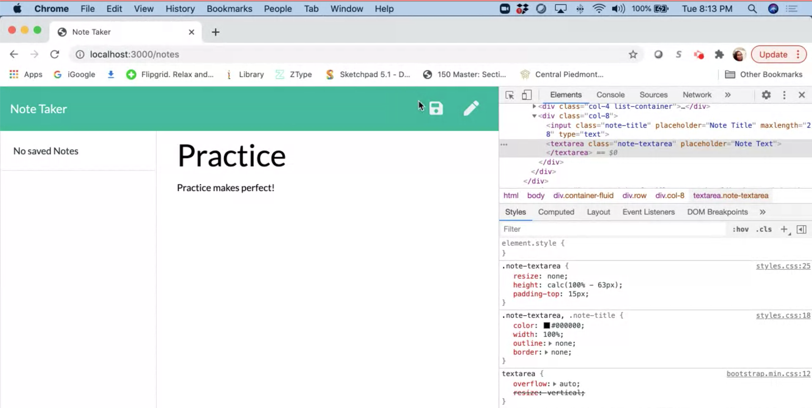
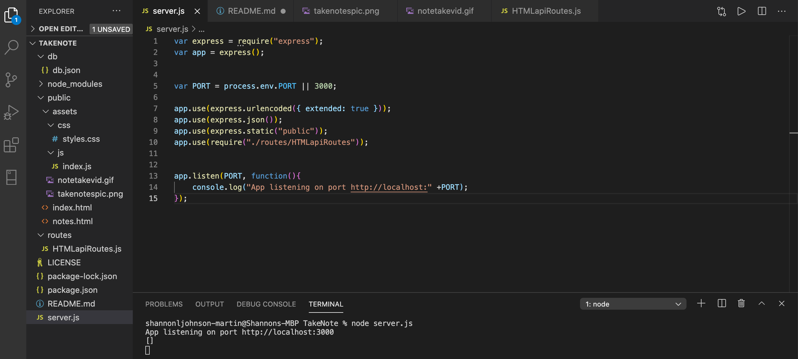
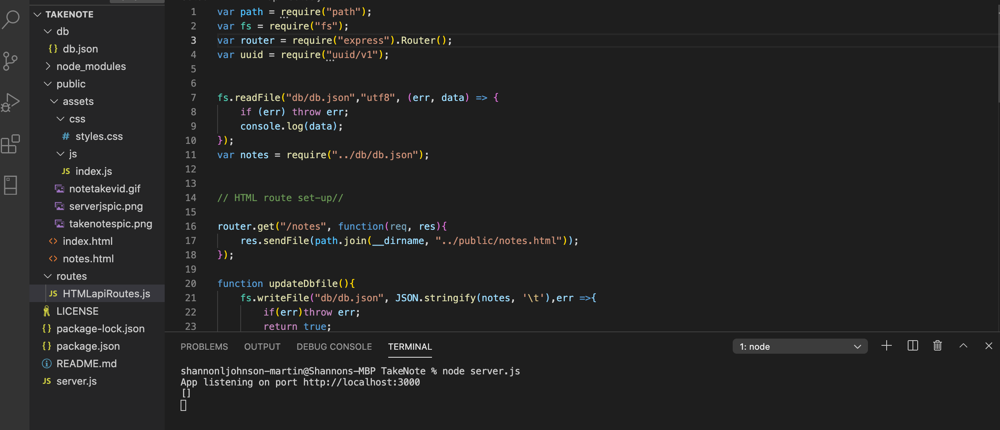

# TakeNote

# Project Description
To create an application that can be used to write, save, and delete notes. This application uses a backend application called Express that allows for saving and retrieving note data from a JSON file.

* This project included a develop folder which provided the frontend. This project will create the backend and establish a connection between both ends while hosting on local port 3000.

# Demo Features:
* The following image and gif shows the web application's appearance and functionality:

# Live URL:
<a href="https://youtu.be/-wuuvFoY74k">Take Note Youtube Video</a>

<a href="https://github.com/sjohn214/TakeNote.git">Take Note GitHub Repo</a>

# Summary
* In this project we created a note taking application, deployed on Heroku while using an express server application. Installs included: package json and express server application.

# Special Features:
* 2 HTML pages
  * Index.html
  * Notes.html
  
* CSS elements 
  * style.css
  
* 2 Javascript pages

  * server.js
  

  * HTMLapiRoutes.js

# Special Features Continued:
  * Node Express
  * Arrays with objects
  * Jquery language
  * Routes for API and HTML
  * API for notes that read db.json
  * db.json for file storage
  * Functions
  * Installed npm package express
  * Installed package-json

# Authors/Contributors
* Shannondale Page (student) <a href="https://github.com/sjohn214">Git Hub Profile</a>
* Austin Bruch (Bootcamp Instructor)
* Jon Jackson (Bootcamp TA Instructor)
* Daniel Sires (Bootcamp Tutor)